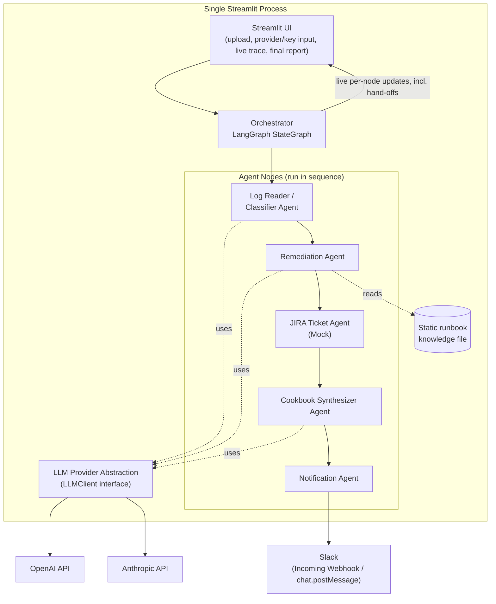
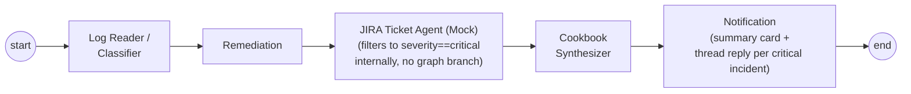
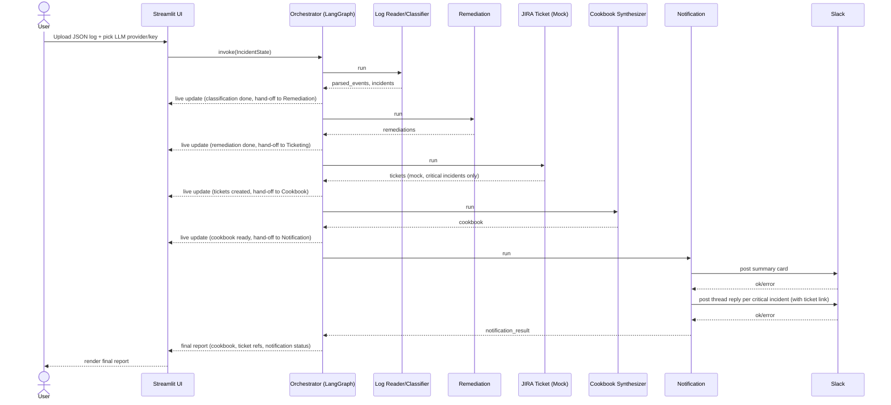

# Architecture: Multi-Agent DevOps Incident Analysis Suite

Companion to [requirements.md](requirements.md). This document covers the workflow and detailed technical architecture.

> **Note on scope:** ticket creation is **mocked** — the JIRA Ticket Agent fabricates a ticket reference in-process; there is no real Jira API call in this iteration. See [requirements.md §8/§9](requirements.md#8-assumptions--constraints) for the reasoning.

## 1. High-Level Architecture

A single Python process: Streamlit UI in the same process as the LangGraph orchestrator, calling out to one external SaaS API (Slack) and one of two LLM providers (Anthropic or OpenAI, chosen at runtime). Jira ticket creation is simulated in-process, with no outbound call.

**Why one process, no separate backend:** the pluggable-LLM + Streamlit-only decision means LangGraph's synchronous `graph.stream()` can drive the UI directly (see §6) — a FastAPI bridge is a production pattern for decoupling async agent execution from a frontend, which this 1-day scope doesn't need.

**Why a fully linear pipeline, not a supervisor (and not even a branch):** LangGraph's supervisor/swarm patterns route each step through an LLM call, which costs roughly 3x a single-pipeline design and adds a failure mode (misrouting) not worth the risk for a linear workflow. Earlier drafts of this design used a graph-level conditional edge to skip ticket creation when nothing was critical; the current agent spec (§2 of requirements.md) makes ticket creation a **per-incident filter inside the JIRA Ticket Agent** (a batch of incidents can have mixed severities, so the decision belongs at the incident level, not the graph level). That removes the only branch — the graph is now a straight line, which is simpler to reason about and demo.

## 2. LangGraph Graph Design

### State schema (`IncidentState`)

| Field | Type | Set by |
|---|---|---|
| `raw_log` | `str` | UI (on upload) |
| `parsed_events` | `list[LogEvent]` | Log Reader/Classifier (intermediate structured extraction) |
| `incidents` | `list[Incident]` (category, severity, source events) | Log Reader/Classifier |
| `remediations` | `list[Remediation]` (incident_id, fix steps, rationale, risk, effort) | Remediation |
| `tickets` | `list[Ticket]` (incident_id, mock ticket id/link, summary) — only for `severity == critical` | JIRA Ticket Agent (Mock) |
| `cookbook` | `str` (Markdown, de-duplicated & prioritized) | Cookbook Synthesizer |
| `notification_result` | `NotificationResult \| None` (summary message id + one thread reply id per critical incident) | Notification |
| `errors` | `list[AgentError]` | any node, on failure |

### Graph edges

The pipeline is strictly linear: `Cookbook Synthesizer` needs incidents + remediations + tickets (so it must run after ticketing), and `Notification` needs the finished Cookbook plus ticket links (so it must run last). There is no fan-out/fan-in in this design — every node has exactly one predecessor and one successor.

## 3. Agent-by-Agent Spec

### 3.1 Log Reader / Classifier Agent
- **Input:** raw uploaded JSON log content.
- **Output:** `parsed_events`, `incidents` (each with category + severity).
- **Tools/APIs:** LLM (via `LLMClient`) for classification; a JSON parser for structural extraction.
- **Prompt responsibility:** given parsed event fields, assign an issue category and severity per event/cluster of related events, with brief reasoning.

### 3.2 Remediation Agent
- **Input:** `incidents`.
- **Output:** `remediations` (fix steps, rationale, risk, effort — per incident).
- **Tools/APIs:** LLM; read access to the static runbook knowledge file (`RB` in the diagram — a Markdown/JSON file mapping issue categories to known fixes).
- **Prompt responsibility:** for each incident, produce fix steps + rationale + a risk estimate (how likely/costly if the fix goes wrong) + an effort estimate (rough size of the work); prefer the runbook entry when the category matches one, otherwise reason from general knowledge and mark the source as "LLM-derived" vs "runbook".

### 3.3 JIRA Ticket Agent (Mock)
- **Input:** `incidents`, `remediations`.
- **Output:** `tickets` — one mock `Ticket` (summary, description built from the incident + its remediation, labels, a generated mock ID like `MOCK-1234` and a fake link) for every incident with `severity == critical`; incidents below critical produce no ticket.
- **Tools/APIs:** none external. Ticket IDs are generated locally (e.g., an incrementing counter or `uuid4` slice) — no Jira account, project, or API token involved. This node cannot fail on a network call, only on malformed input.

### 3.4 Cookbook Synthesizer Agent
- **Input:** `incidents`, `remediations`, `tickets` (i.e., full run state so far).
- **Output:** `cookbook` (Markdown, de-duplicated, ordered by severity, ticket links included where present).
- **Tools/APIs:** none external — pure aggregation/formatting, optionally LLM-assisted for phrasing.

### 3.5 Notification Agent
- **Input:** `cookbook`, `tickets`.
- **Output:** `notification_result` (Slack message id for the summary card + one thread-reply id per critical incident).
- **Tools/APIs:** Slack Incoming Webhook (`POST` JSON) or `chat.postMessage` if a bot token is configured. Posts exactly one summary card per run (from the Cookbook), then one threaded reply per critical incident, each including that incident's mock ticket link.

## 4. LLM Provider Abstraction

A minimal `LLMClient` interface (e.g. `.classify(...)`, `.complete(...)`, or a `with_structured_output()`-style call) with two adapters: `AnthropicClient`, `OpenAIClient`. The Streamlit sidebar lets the user pick a provider and paste an API key; the key lives only in Streamlit session state for the duration of the run — never written to disk, logged, or sent anywhere other than the chosen provider's API. Agent nodes depend only on the `LLMClient` interface, not on a specific provider, so adding a third provider later is a new adapter, not a graph change.

## 5. Data Flow (Sequence)

## 6. Streaming / UI Integration

The Streamlit script calls `graph.stream(initial_state, stream_mode=["updates", "custom"])` synchronously and iterates over the yielded chunks in the same script run, updating a live trace panel (e.g., one `st.status()` block per agent) as each node completes — including an explicit "hand-off" indicator (e.g., an arrow/connector animation or a simple "→ passing to Remediation Agent" caption) so the multi-agent structure is visibly legible to a demo audience, not a black box. This keeps the whole app to one process with no background workers or websockets, which matches the 1-day/no-separate-backend constraint.

## 7. Error Handling

- **Slack call failure:** caught at the Notification node, recorded in `errors`, surfaced in the UI as a warning — the Cookbook and mock tickets are already computed and still render regardless of Slack's outcome.
- **Malformed/unparseable log input:** the Log Reader/Classifier agent returns a clear error state; the UI shows the parse error and, where a partial parse is possible (some valid JSON lines mixed with invalid ones), proceeds with the valid subset and flags the rest.
- **LLM call failure (timeout/rate limit/etc.):** one retry at the node level; if it fails again, the node records the error and the orchestrator surfaces it in the UI rather than crashing the run.
- **Ticket generation (mock):** purely local, so failure here would only be a bug (e.g., malformed remediation input) rather than an external outage — handled like any other node error (record + surface, don't crash the run).

## 8. Tech Stack

| Concern | Choice |
|---|---|
| Language | Python |
| Agent orchestration | LangGraph (`StateGraph`) |
| UI | Streamlit |
| LLM SDKs | `langchain-anthropic`, `langchain-openai` (behind the `LLMClient` interface) |
| Slack integration | Incoming Webhook via `requests`, or `slack_sdk` if using a bot token |
| Ticket generation | Local mock only — no external SDK; simple ID generator (counter or `uuid4`) |
| State schema | `pydantic` models |

## 9. Security / Config

- Secrets (LLM API key, Slack webhook URL/bot token) are supplied via `.env` (local) or Streamlit session input — never hardcoded. No Jira credentials are needed since ticketing is mocked.
- A `.env.example` file is committed with placeholder keys documenting what's required; the real `.env` is gitignored.
- No secret values are ever written to logs or included in the UI trace output.

## 10. Demo Fixtures

Two to three synthetic JSON log files, each seeded with 1-2 known issue types (e.g., an OOM crash, a DB connection timeout, a disk-full event, at least one at `critical` severity so the mock ticketing + Slack thread-reply path is exercised in every demo run), ship with the app so the live demo doesn't depend on sourcing real production logs on the day.

## 11. Future Enhancements (Out of Scope Now)

- Real Jira API integration, replacing the current mocked ticket agent (highest-value swap if this becomes a real product).
- Real vector-database-backed RAG over a larger runbook corpus, replacing the static knowledge file.
- Live/streaming log ingestion (tailing real infra sources) instead of file upload.
- Additional log format parsers (plain text, syslog) and auto-detection.
- Persistence and a cross-run history/analytics dashboard.
- Dynamic, LLM-routed supervisor orchestration in place of the fixed pipeline.
- Multi-tenant auth and role-based access control.
